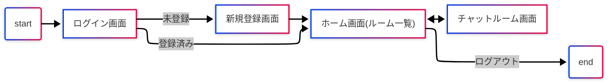
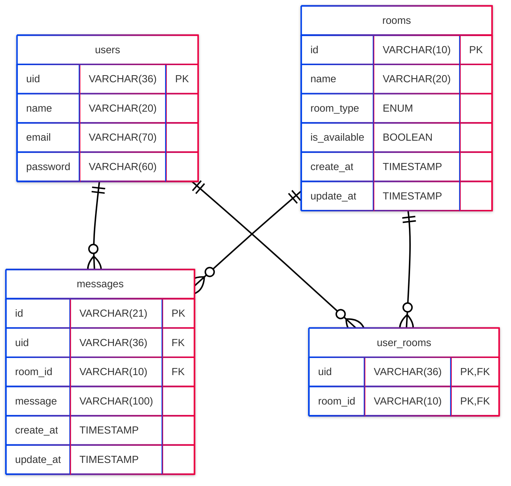

<h1 align="center">Nope - ノウプ</h1>
 

## コンセプト

「知り合ったばかりの人とLINE交換するの嫌じゃない？」

## アプリ概要

我々Team Mは、 "繋がりすぎる時代" にちょっと距離感のあるチャットアプリを考えました。\
LINEに友達登録されている人でこれ誰だったっけ？っていう方はいませんか？\
何年も前にたまたま会ってその場のノリでLINE交換したけど、その後一切連絡取らずに疎遠になった人、連絡網がわりのグループライン、こんな人会ったことあるっけ？と顔を見ても名前を見てもピンとこない人など・・・\
直近で連絡を取り合う必要があるなど、友達未満、知り合いレベルの方との連絡を取るためのアプリです。\

## ユーザの課題

「普段使いのチャットアプリはまだ教えたくない」、「SNSは私生活が知られるから嫌だ」、でも直近で連絡を取り合う必要があるなど、友達未満、知り合いレベルの方との連絡を取るためのアプリです。

## 機能一覧

## 仕様技術

| Category | Technology |
|----------|------------|
| Frontend | HTML, CSS, JavaScript, Jinja2 3.1.2 |
| Backend | Python3.11.3, Flask 2.3.3 |
| Infrastructure | --- |
| Database | MySQL 8.0 |
| Monitoring | --- |
| Environment setup | Docker |
| CI/CD | --- |
| Design | Figma |
| etc. | GitHub, Notion, Mattermost, ovice, mermaid |

## ER図

## 今後の展望
