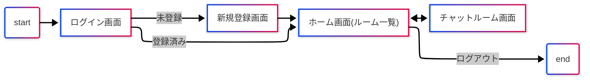
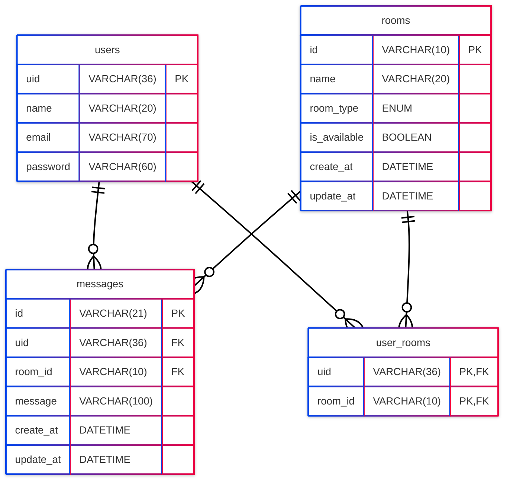

<h1 align="center">Nope - ノウプ</h1>
 

# アプリ概要

## コンセプト
我々Team Mは、 _"繋がりすぎる時代"_ にちょっと距離感のあるチャットアプリを考えました。\
LINEに友達登録されている人で「これ誰だったっけ？」という方はいませんか？\
何年も前にたまたま会ってその場のノリでLINE交換したけど、その後一切連絡取らずに疎遠になった人、連絡網がわりのグループライン、「こんな人会ったことあるっけ？」と顔を見ても名前を見てもピンとこない人など...\
直近で連絡を取り合う必要があるなど、友達未満、知り合いレベルの方との連絡を取るためのアプリです。

## ユーザの課題
「普段使いのチャットアプリはまだ教えたくない」\
「SNSは私生活が知られるから嫌だ」\
 でも直近で連絡を取り合う必要がある。

## 解決方法
- 連続した投稿をできなくする。
- 投稿の文字数を100文字に制限する。
- 1か月やりとりがない友達を自動で削除する。
- 既読機能を設けない。
- 友達登録はQRコードのみにする。

# 機能一覧

## フローチャート

## 仕様技術
| Category | Technology |
|----------|------------|
| Frontend | HTML, CSS, JavaScript, Jinja2 3.1.2 |
| Backend | Python3.11.3, Flask 2.3.3 |
| Infrastructure | --- |
| Database | MySQL 8.0 |
| Monitoring | --- |
| Environment setup | Docker |
| CI/CD | --- |
| Design | Figma |
| etc. | GitHub, Notion, Mattermost, ovice, mermaid |

## MVP・追加機能
| 機能 | 分類 | 優先順位 | 進捗状況/フロント | 進捗状況/バックエンド |
| --- | --- | --- | --- | --- |
| 新規登録 | MVP | 1 | 完了 | 完了 |
| ログイン | MVP | 2 | 完了 | 完了 |
| ログアウト | MVP | 3 | 完了 | 完了 |
| チャットルーム(友達)追加 | MVP | 4 | 完了 | 完了 |
| チャットルーム(友達)一覧表示 | MVP | 5 | 完了 | 完了 |
| メッセージ送信 | MVP | 6 | 完了 | 完了 |
| メッセージ一覧表示 | MVP | 7 | 完了 | 完了 |
| ☆連投防止 | 追加機能 | 8 | 完了 | 完了 |
| ☆チャットルーム(友達)削除 | 追加機能 | 9 | 完了 | 完了 |
| メッセージ編集 | 追加機能 | 10 | 完了 | 完了 |
| メッセージ取り消し | 追加機能 | 11 | 完了 | 完了 |
| メッセージ受信 | 追加機能 | 12 | — | — |
| メッセージ字数制限(100文字) | 追加機能 | 13 | 完了 | 完了 |
| チャットルーム(友達)の自動削除 or 非表示 | 追加機能 | 14 | — | 完了 |

## 機能要件
| 分類1 | 分類2 | 要件内容 |
| --- | --- | --- |
| 共通 | UI | スマホでの利用を想定。レスポンシブ非対応。 |
| 認証機能 | ログイン機能 | ユーザはメールアドレス・パスワードでログインすることができる。 |
|  | 新規登録機能 | ユーザはアカウント名・メールアドレス・パスワード・パスワード再入力で登録が完了する。 |
|  | ログアウト機能 | セッション情報をクリアし、ログイン画面に戻る。 |
| メッセージ機能 | 一覧表示機能 | チャットルームのメッセージ表示部分にチャット相手とのメッセージをすべて表示する。スクロールバー設置。メッセージは画面下(New)→上(Old)の順に並ぶ。 |
|  | 送信機能 | チャットルーム画面にテキストボックス・送信ボタンを配置。文字数は100文字以内。(追加機能) |
|  | 受信機能 | 相手からメッセージが送られてきたとき、画面が更新される。 |
|  | 編集機能 | 最新のメッセージが送信者のとき、最新のメッセージのみ編集することができる。 |
|  | 削除機能 | 最新のメッセージが送信者のとき、最新のメッセージのみ削除することができる。 |
|  | ☆連投防止機能 | コア機能。最新のメッセージが送信者のとき、送信者はメッセージを送信できない。 |
| 友達機能 | 一覧表示機能 | 新着メッセージ順で並び替え。スクロールバー設置。画面は上→下で昇順に並ぶ。 |
|  | 追加機能 | QRコードで友達追加。相手が承認にすると友達に追加される。 |
|  | 削除機能 | 1か月やり取りしてない友達は自動削除。(追加機能) |

## URL設計
| 分類 | 目的 | エンドポイント | method |
| --- | --- | --- | --- |
| ルート |  | / | GET |
| 認証 | ログイン画面表示 | /login | GET |
|  | ユーザ情報照会 | /login | POST |
|  | 新規登録画面の表示 | /signup | GET |
|  | ユーザの新規登録 | /signup | POST |
|  | ログアウト | /logout | POST |
| チャットルーム | ルームを一覧表示 | /home | GET |
|  | ルームをあいまい検索で絞り込み | /home | POST |
|  | ルームを自動で削除 | /room/delete | GET |
|  | ルーム(友達)を追加 | /room/add | POST |
|  | QRコードを表示 | /invite/sender/<room_id> | GET |
|  | QRコードを読み取り後、友達追加の確認画面の表示 | /invite/receiver/<room_id> | GET |
|  | 友達を追加する | /invite/receiver/<room_id> | POST |
|  | QRコードを返す | /invite/qrcode/<room_id> | GET |
|  | ルーム(友達)を削除 | /room/delete/<room_id> | POST |
| メッセージ | ルーム内のメッセージを一覧表示 | /room/<room_id>/messages | GET |
|  | メッセージを送信する | /room/<room_id>/add/message | POST |
|  | メッセージを編集する | /room/<room_id>/message/edit/<message_id> | POST |
|  | メッセージを削除する | /room/<room_id>/message/delete/<message_id> | POST |

## DB設計

### usersテーブル
| Field | Type | Null | KEY | Default | Extra | 備考 |
| --- | --- | --- | --- | --- | --- | --- |
| uid | VARCHAR(36) | NOT NULL | PRYMARY KEY |  |  | uidをUUID4で生成36文字 |
| name | VARCHAR(20) | NOT NULL |  |  |  |  |
| email | VARCHAR(70) | NOT NULL | UNIQUE KEY |  |  | 最大70文字outlook(70), Gmail(40)etc...(概算) |
| password | VARCHAR(60) | NOT NULL | UNIQUE KEY |  |  | Bcrypt:バージョン4 + コスト3 + ソルト22 + ハッシュ31 = 計60文字 |

### roomsテーブル
| Field | Type | Null | KEY | Default | Extra | 備考 |
| --- | --- | --- | --- | --- | --- | --- |
| id | VARCHAR(10) | NOT NULL | PRYMARY KEY |  |  | NanoIDで生成size=10 |
| name | VARCHAR(20) |  |  | NULL |  | もしもグループトークを追加したとき用 |
| room_type | ENUM(’dm’, ’group’) | NOT NULL |  | dm |  | もしもグループトークを追加したとき用 |
| created_at | DATETIME | NOT NULL |  | CURRENT_TIMESTAMP |  |  |
| updated_at | DATETIME | NOT NULL |  | CURRENT_TIMESTAMP | ON UPDATE CURRENT_TIMESTAMP | 1か月更新がない時はis_available=0 |
| is_available  | BOOLEAN | NOT NULL |  | 1 |  | フレンド誤削除復元用/1=active |

### user_roomsテーブル
| Field | Type | Null | KEY | Default | Extra | 備考 |
| --- | --- | --- | --- | --- | --- | --- |
| uid | VARCHAR(36) | NOT NULL | PRYMARY KEY, FOREIGIN KEY |  |  |  |
| room_id | VARCHAR(10) | NOT NULL | PRYMARY KEY, FOREIGIN KEY |  |  |  |

### messagesテーブル
| Field | Type | Null | KEY | Default | Extra | 備考 |
| --- | --- | --- | --- | --- | --- | --- |
| id | VARCHAR(21) | NOT NULL | PRYMARY KEY |  |  | NanoIDのデフォルト21文字 |
| uid | VARCHAR(36) | NOT NULL | FOREIGIN KEY |  |  |  |
| room_id | VARCHAR(10) | NOT NULL | FOREIGIN KEY |  |  |  |
| message | VARCHAR(100) | NOT NULL |  |  |  | 字数制限100文字(アプリの仕様) |
| created_at | DATETIME | NOT NULL |  | CURRENT_TIMESTAMP |  |  |
| updated_at | DATETIME | NOT NULL |  | CURRENT_TIMESTAMP | ON UPDATE CURRENT_TIMESTAMP |  |

## ER図

## 今後の展望
- エラー画面の導入
- グループトークの導入検討
- 入力文字数の表示
- 登録情報編集
- 削除された友達の表示および復元
- メッセージ受信・通知